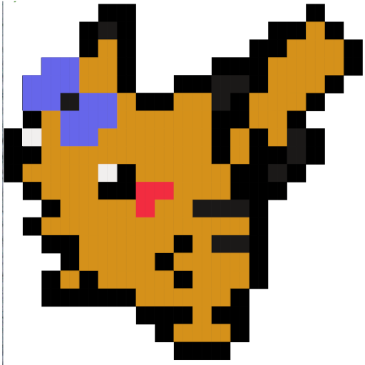
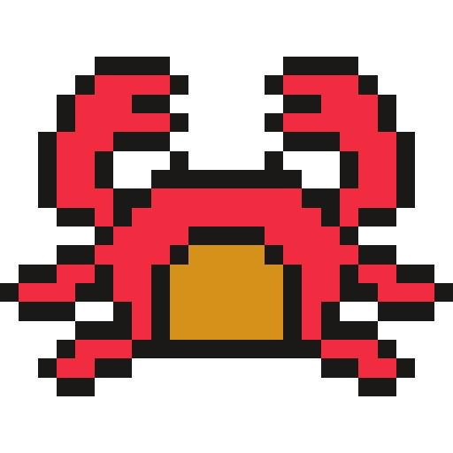
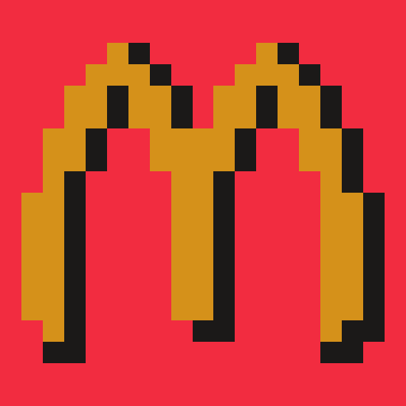

  
  
  
  
  
  
  
  
  
  
  

----

# Toolbelt
Collection of scripts, dotfiles and self-created guides that follow me on all
of my linux adventures

## :hammer: [Powertools](powertools) (.dotfiles)
Static config files

## 🧰 [Toolbox](toolbox)(scripts)
Scripts used in the terminal or on a keybind
* [ascii2png](toolbox/ascii2png.tool) convert [fetch](toolbox/fetch.tool) logos to png
* [autologin](toolbox/autologin.tool) setup auto login in TTY (by [Mendess](https://github.com/mendess))
* [blind](toolbox/blind.tool) brightness control for screens and keyboards (integrates with [thonkbar](https://github.com/JoseFilipeFerreira/thonkbar) and [range2color](toolbox/range2color))
* [bulkrename](toolbox/bulkrename.tool) rename files in your `$EDITOR` (by [Mendes](https://github.com/mendess/))
* [calendar](toolbox/calendar.tool) notify of next event (with action to open it)
* [calsync](toolbox/calsync.tool) Sync calendar with vdirsyncer
* [colors](toolbox/colors.tool) display all color codes for text formating (from [flogisoft](https://misc.flogisoft.com/bash/tip_colors_and_formatting))
* [cuffs](toolbox/cuffs.tool) screenshot tool
* [deaf](toolbox/deaf.tool) volume changer
* [death](toolbox/death.tool) warn if all batteries are bellow a certain percent
* [dlanime](toolbox/dlanime.tool) TUI to download from [nyaa](https://nyaa.si) based on data from [MAL](https://myanimelist.net)
* [dmenu_IQ](toolbox/dmenu_IQ.tool) dmenu app launcher with app usage history
* [ex](toolbox/ex.tool) extract anything
* [fetch](toolbox/fetch.tool) neofetch wrapper to show logo based on hostname
* [focus-bro](toolbox/focus-bro.tool) help me focus (by [Mendes](https://github.com/mendess/))
* [icons](toolbox/icons.tool) icon pack manager for [toolicons](powertools/toolicons)
* [labib](toolbox/labib.tool) compile LaTeX and BibTeX with a single commmand
* [launch-and-move](toolbox/launch-and-move.tool) move to a workspace and launch a program (if that program is not running)
* [menu](toolbox/menu.tool) dmenu menu launcher
* [meross-cli](toolbox/meross-cli.tool) control meross lights (integrates with [merossd](https://github.com/JoseFilipeFerreira/merossd))
* [nospace](toolbox/nospace.tool) correct filenames
* [pixel](toolbox/pixel.tool) TUI to draw pixelart for [neofetch](powertools/neofetch)
* [qbt](toolbox/qbt.tool) qbittorrent management on remote
* [qrwifi](toolbox/qrwifi.tool) generate qrcode for the current wifi connection
* [range2color](toolbox/range2color.tool) Convert a value inside a numeric range to a color inside a color range
* [share](toolbox/share.tool) share files in my webserver
* [term-from-here](toolbox/term-from-here.tool) open terminal in the current user, machine and directory
* [timer](toolbox/timer.tool) timer with message and alarm sound
* [udm](toolbox/udm.tool) playlist manager (integrates with [thonkbar](https://github.com/JoseFilipeFerreira/thonkbar))
* [vimtemp](toolbox/vimtemp.tool) open your `$EDITOR` and copy to clipboard on save&exit
* [wall](toolbox/wall.tool) wallpaper manager (integrates with [dmenu](https://github.com/mendess/dmenu)) (color picker by [mendess](https://github.com/mendess))

## :wrench: [Toolkit](powertools/dmenu/scripts) (dmenu scripts)
Scripts launched from my [menu](toolbox/menu.tool)
* [clippy](powertools/dmenu/scripts/clippy.menu) simple bookmark manager
* [dock](powertools/dmenu/scripts/dock.menu) choose display setting
* [games](powertools/dmenu/scripts/games.menu) launch games from steam
* [nitro](powertools/dmenu/scripts/nitro.menu) pick from a list of emojis and gifs
* [power](powertools/dmenu/scripts/power.menu) machine state menu
* [todo](powertools/dmenu/scripts/todo.menu) simple TODO list using [todoman](https://github.com/pimutils/todoman) and [vdirsyncer](https://github.com/pimutils/vdirsyncer)
* [trayer](powertools/dmenu/scripts/trayer.menu) toggle trayer
* [wine](powertools/dmenu/scripts/wine.menu) launch programs installed with [wine](https://www.winehq.org/)

## :iphone: [Handtools](handtools)
Scripts I use on my phone (used with [Tasker](https://tasker.joaoapps.com/) and
[Termux](https://github.com/termux/termux-app))
* [change_lock](powertools/termux/handtools/change_lock.tool) change phone wallpaper
* [control_music](powertools/termux/handtools/control_music.tool) control music on a remote device
* [music_devices](powertools/termux/handtools/music_devices.tool) choose a remote device to connect with history
* [sync_kiwi](powertools/termux/handtools/sync_kiwi.tool) sync phone data with remote
* [toggle_light](powertools/termux/handtools/toggle_light.tool) toggle lights

## :link: Install
Installation scripts I use to setup my dotfiles
* [generate_config](./generate_config) templating language for dotfiles (by [Mendess](https://github.com/mendess/spell-book))
* [hammer](./hammer) Deploy dotfiles and install programs that are part of my [workflow](.workflow.csv)
* [label-printer](./label-printer) autogenerate [README](README.md)
* [link-check](./link-check) check the validity of relative and hard links in all the md files
* [nail](./nail) symlink dotfiles and scripts

## :blue_book: [Blueprints](blueprints)
Notes I take on my linux ~~tribulations~~ adventures in case I ever need to repeat them

## License
This project is licensed under the MIT License - see the [LICENSE](LICENSE) file for details
